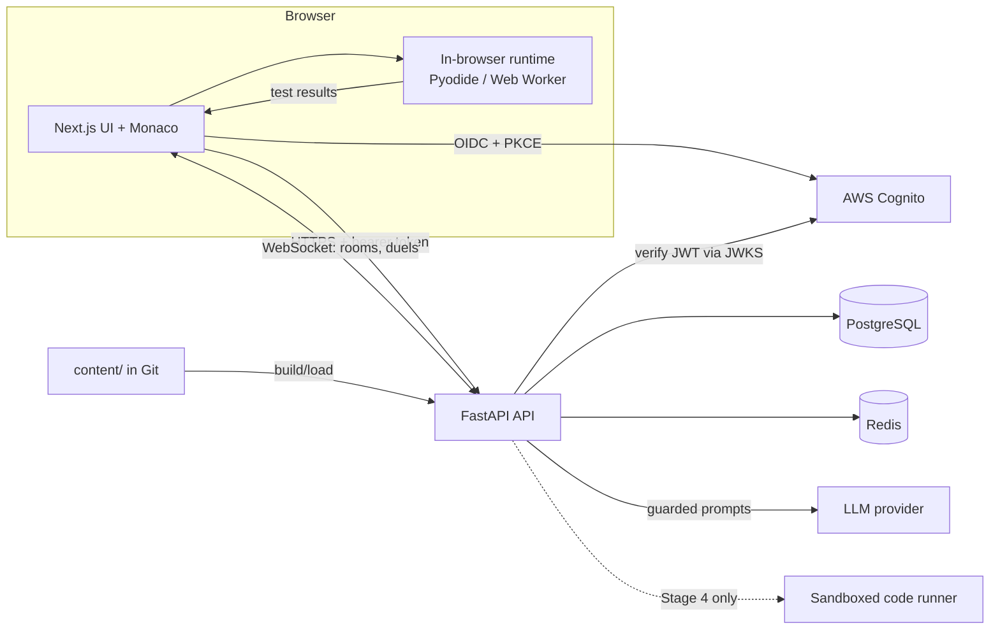

# Architecture

**Status: partly built.** Stage 0 exists — the two applications, PostgreSQL, Redis, and migrations
all run locally. Everything else here is the architecture the project has decided to build, not a
description of running software.

Built today: `apps/web`, `apps/api`, `/health`, the `users` table, local datastores.
Not built: authentication, in-browser runtime, lesson content, the AI mentor, the sandboxed runner,
and all multiplayer.

Verify against the filesystem before treating anything here as implemented. Current state:
[docs/PROJECT_STATE.md](./docs/PROJECT_STATE.md).

## System Shape

Two deployable applications and one durable datastore, kept in a single repository.

## Components

### `apps/web` — Next.js application

Owns everything the learner sees: lesson player, Monaco editor, mentor chat panel, profile, lobby
and duel screens. Holds no durable state of its own and never opens a database or Redis connection.
All reads and writes go through the API.

### `apps/api` — FastAPI application

The only component that touches persistence. Responsibilities:

- authentication and session management
- serving lesson and challenge content
- recording submissions, progress, XP, streaks
- the AI mentor endpoint, including the guardrail layer
- WebSocket endpoints for rooms, matchmaking, and duel state

### In-browser runtime

Executes learner code inside the browser (Pyodide for Python, a Web Worker for JavaScript) and
reports test results to the UI. Chosen so that early stages need no code-execution infrastructure
and carry no sandbox-escape risk. See
[ADR-0003](./docs/adr/0003-browser-first-code-execution.md).

### Sandboxed runner — Stage 4 only

Server-side execution of untrusted code, introduced when duels require results the platform can
trust. Must enforce CPU, memory, network, filesystem, and wall-clock limits. Does not exist and must
not be built ahead of an ADR describing its isolation model.

### `content/` — lesson and challenge definitions

Lessons, tasks, starter code, and hidden tests stored as reviewable files under version control
rather than rows created through an admin interface.

## Boundaries

These are the lines the system is designed around.

- **Browser ↔ API is the only trust boundary that matters for data.** Anything the browser sends is
  untrusted input, including reported test results.
- **The web app has no database credentials.** Persistence belongs exclusively to the API.
- **The mentor never reaches the model unmediated.** Every mentor request passes through a
  project-owned prompt layer, and every response passes a server-side solution check before it
  reaches the client.
- **Learner code and platform code never share a process.** In-browser during Stages 1–3, in an
  isolated sandbox from Stage 4.

## Data Flow

**Completing a lesson (Stages 1–3)**

1. Web requests the lesson from the API.
2. Learner edits code in Monaco; the in-browser runtime executes it against the lesson's tests.
3. Results render locally for instant feedback.
4. Web posts the submission to the API, which records progress and awards XP.

Because step 2 happens client-side, submitted results are advisory. Anything that must be
trustworthy — ratings, competitive outcomes — requires the Stage 4 runner.

**Asking the mentor (Stage 2)**

1. Web sends the lesson, the learner's current code, failing test output, and the requested hint
   level to the API.
2. The API builds a constrained prompt, calls the provider, and inspects the response.
3. A response containing a working solution is rejected or reduced before it is returned.
4. Usage is recorded against the learner's rate and cost budget.

**Playing a duel (Stage 4)**

1. Both players join a room over WebSocket; Redis holds room and matchmaking state.
2. Submissions are executed by the sandboxed runner, not the browser.
3. Opponents receive progress signals only, never code.
4. The outcome and rating change are written to PostgreSQL.

## Storage

| Store | Holds | Loss tolerance |
| --- | --- | --- |
| PostgreSQL | accounts, progress, submissions, XP, streaks, ratings, duel results | none — durable source of truth |
| Redis | sessions/cache, matchmaking queues, live room state, rate-limit counters | acceptable — must be rebuildable |
| Git (`content/`) | lessons, challenges, tests | none — versioned with the code |

Rationale: [ADR-0002](./docs/adr/0002-postgres-primary-redis-ephemeral.md).

## Authentication and Authorisation

**Decided, not built.** AWS Cognito is the identity provider and owns credentials, sign-up, login,
and recovery. Buzzly stores no passwords.

The browser completes OIDC Authorization Code with PKCE against Cognito and sends the resulting
token to the API, which verifies it statelessly against Cognito's JWKS. There is no server-side
session store and no refresh rotation owned by us.

The `users` table keys on the Cognito `sub` claim and holds only application data. It deliberately
has no email or password column, so the application database never becomes a credential or PII
target.

Reasoning and rejected alternatives: [ADR-0007](./docs/adr/0007-cognito-identity-stateless-jwt.md).
Still open: which token is sent, its lifetime, JWKS caching, and how local development authenticates.

## External Dependencies

- **AWS Cognito** for identity. A login outage is an AWS outage.
- **LLM provider** for the mentor — provider undecided; must sit behind the project's own prompt and
  guardrail layer so it can be swapped.
- **Pyodide** for in-browser Python execution.

## Deployment

Undecided. Stage 0 targets local development through containers; the hosting target is an open
decision recorded in [docs/PROJECT_STATE.md](./docs/PROJECT_STATE.md).

## Key Invariants

Enforced by review, and where possible by code:

1. The mentor never returns a working solution — checked server-side on model output.
2. Untrusted code never runs unsandboxed on a server.
3. The web app never connects to PostgreSQL or Redis.
4. PostgreSQL holds anything whose loss would matter; Redis holds nothing that cannot be rebuilt.
5. Client-reported results are never trusted for competitive outcomes.

Changing any of these requires a new ADR in [docs/adr/](./docs/adr/).
